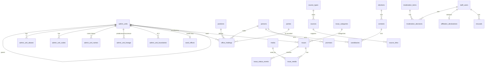

# Hamro Ward — 05 Domain Data Model

> **Status:** Draft v0.2
> **Date:** 2026-09-17
> **Database:** PostgreSQL with PostGIS and `pg_trgm` (pgvector added in v1.2)
> **Implements:** `02` rules R1–R16, D-002, `03` FR/NFR
> **Consumers:** Laravel migrations (`apps/api/database/migrations/{central,tenant}`), the importer, and API resources
> **Tenancy:** Every table below lives in either the **central** database or each **tenant** (local level) database. Placement is defined in `12_TENANCY_AND_IDENTITY.md` §3; accounts in `12` §11–12

---

## 1. Conventions

**Database placement shorthand:** `[C]` = central, `[T]` = tenant, `[C→T]` = central table with a read-only replica in each tenant.

| Section | Placement |
|---|---|
| §3 Geography | `[C→T]` (tenant replica holds only its own subtree); `ward_offices` `[T]` |
| §4 Provenance | `source_types` `[C→T]`; `sources` `[C]` national and `[T]` local; `source_links`, `fact_conflicts` in **both**: `[C]` for central subjects (geography, persons, parties), `[T]` for tenant subjects |
| §5 Offices | `positions` `[C→T]`; `persons`, `parties` `[C]`; `office_holdings`, `vacancies`, `v_current_seats` `[T]` |
| §6–8 Issues, media, moderation, corrections | `[T]` (`issue_categories` `[C→T]`) |
| §9 Staff, accounts, audit | `[C]`; `audit_events` exists in `[C]` and every `[T]` |
| §10 Later entities | `elections` `[C]`; promises, contests, candidacies, projects, documents `[T]` |
| §11 Calendar | `[C→T]` |

| Topic | Convention |
|---|---|
| Primary keys | `id uuid`, time-ordered UUIDs generated by the application (Laravel `HasUuids`). Exception: `audit_events` uses `bigint` identity for append speed |
| Public identifiers | `slug` for geography, persons and parties; `public_id` (10-character Crockford base32) for issues, corrections and promises. Internal UUIDs are never used in public URLs |
| Enumerations | `text` columns with `CHECK` constraints, mirrored by PHP backed enums. **No** PostgreSQL `ENUM` types, because they are harder to migrate |
| Bilingual text | `*_ne` (Devanagari, canonical) and `*_en` (romanized/English). Either may be null, but not both, via `CHECK (x_ne IS NOT NULL OR x_en IS NOT NULL)` |
| Timestamps | `timestamptz`, stored in UTC. All tables have `created_at` and `updated_at`, except append-only tables |
| Calendar dates | `date` (AD). BS values are derived from `bs_calendar_months` (§11). Source documents also keep `*_as_written text` (R14) |
| Temporal validity | `valid_from date NULL`, `valid_to date NULL`; `NULL valid_to` means current. `CHECK (valid_to IS NULL OR valid_from IS NULL OR valid_to >= valid_from)` |
| Soft deletes | Not used for factual data. Changes are versioned and audited. Moderated content uses moderation states |
| Money | `bigint`, in whole NPR (paisa are not needed for budgets) |
| Geometry | SRID 4326. Points use `geography(Point)`; boundaries use `geometry(MultiPolygon)` |
| Foreign keys | Always declared **within one database**. `ON DELETE RESTRICT` by default; `CASCADE` only for pure child rows. References from a tenant to central rows (`person_id`, `party_id`, `reporter_user_id`, central `source_id`) are plain UUID columns validated by the application and the nightly consistency check (`12` §4.1) |
| Polymorphic links | `subject_type text` + `subject_id uuid`, used only where noted (source links, moderation, audit). `subject_type` uses a morph map with short keys (`admin_unit`, `person`, `office_holding`, `issue`, …) and a `CHECK` on allowed values |

---

## 2. Entity overview



Polymorphic links are not drawn: `source_links`, `moderation_items`, `audit_events`, `fact_conflicts`, `corrections`.

---

## 3. Geography (v0.1) — R1–R6

### 3.1 `admin_units`

A single table for all levels. Level rules are enforced by constraints and a trigger.

| Column | Type | Notes |
|---|---|---|
| id | uuid PK | |
| level | text | `country`, `province`, `district`, `local_level`, `ward` |
| parent_id | uuid FK → admin_units NULL | NULL only for `country` |
| local_level_type | text NULL | `metropolitan_city`, `sub_metropolitan_city`, `municipality`, `rural_municipality`. Required if and only if `level = local_level` |
| ward_number | smallint NULL | Required if and only if `level = ward`. `CHECK (ward_number BETWEEN 1 AND 99)` |
| slug | text | Lowercase ASCII, `^[a-z0-9-]+$`. For a ward, the slug is the ward number as text |
| name_ne, name_en | text | Current names, denormalized from `admin_unit_names` |
| ancestor_ids | uuid[] NOT NULL DEFAULT '{}' | Root-first ancestors, **written by the trigger only**; GIN index. Used by the publication rule and tenant subtree replication |
| is_published | boolean DEFAULT false | Public visibility gate (D-006). Set only through `PublishAdminUnit`, top-down |
| published_at | timestamptz NULL | |
| valid_from, valid_to | date NULL | R3 |
| created_at, updated_at | timestamptz | |

**Constraints and indexes**

* `CHECK ((level = 'local_level') = (local_level_type IS NOT NULL))`
* `CHECK ((level = 'ward') = (ward_number IS NOT NULL))`
* `CHECK ((level = 'country') = (parent_id IS NULL))`
* Trigger `admin_units_hierarchy`: the parent's level must be the level directly above (country → province → district → local level → ward); **level and parent never change** after insert (restructures close the unit and record lineage); a current unit cannot sit under a closed parent; a unit with current children cannot be closed; `ancestor_ids` is maintained.
* Unique: one current country; ward slug equals its ward number; `CHECK (NOT is_published OR published_at IS NOT NULL)`.
* `tenants.admin_unit_id` references `admin_units` and must be a local level (trigger `tenants_local_level`).
* Unique `(parent_id, slug) WHERE valid_to IS NULL` — sibling slugs are unique among current units.
* Unique `(parent_id, ward_number) WHERE level = 'ward' AND valid_to IS NULL` — R2.
* Index `(level, is_published)`.
* Index `(parent_id)`.

**Publication rule.** A unit is publicly visible only when it and all its ancestors have `is_published = true`. Publishing a ward whose local level is unpublished is rejected by an application action.

### 3.2 Supporting tables

| Table | Columns | Notes |
|---|---|---|
| `admin_unit_names` | id, admin_unit_id FK, name_ne, name_en, valid_from, valid_to | Name history; one current row per unit. A rename closes the current row and opens a new one. Sources attach through central `source_links` |
| `admin_unit_slugs` | id, admin_unit_id FK, slug_path text UNIQUE, is_current boolean | Full path (e.g. `koshi/sunsari/example/4`) for resolution and 301 redirects (FR-GEO-05) |
| `admin_unit_aliases` | id, admin_unit_id FK CASCADE, alias text, script text (`deva`, `latn`), kind text (`legacy`, `variant`, `misspelling`, `abbreviation`), normalized text | GIN trigram index on `normalized` (FR-GEO-07) |
| `admin_unit_codes` | id, admin_unit_id FK CASCADE, scheme text (`cbs_census_2021`, `ecn`, `mofaga`, `survey_dept`, `legacy_province_no`), code text | UNIQUE (scheme, code) and (admin_unit_id, scheme) — R4 |
| `admin_unit_lineage` | id, predecessor_id FK, successor_id FK, event text (`restructure_2017`, `merge`, `split`, `rename`, `type_change`), effective_date date, note | `CHECK (predecessor_id <> successor_id)` |
| `admin_unit_boundaries` (v0.3) | id, admin_unit_id FK, geom geometry(MultiPolygon, 4326), geom_simplified geometry(MultiPolygon, 4326), source_id FK, valid_from, valid_to | GIST index. Only one current boundary per unit |
| `ward_offices` `[T]` | id, ward_id FK → tenant replica of admin_units, UNIQUE, address_ne, address_en, phone text, email text, location geography(Point) NULL, office_hours_ne, office_hours_en | Every field needs a source link to be shown (FR-SRC-02) |

---

## 4. Provenance (v0.1) — FR-SRC, R16

### 4.1 `source_types` (configuration)

| key | authority_rank | default_provenance_type |
|---|---|---|
| `ecn` | 1 | official |
| `government_of_nepal` | 2 | official |
| `local_level` | 3 | official |
| `ward_office` | 4 | official |
| `candidate_submission` | 5 | candidate_submitted |
| `party_official` | 6 | candidate_submitted |
| `government_document` | 7 | public_record |
| `media` | 8 | media_report |
| `community` | 9 | community_report |
| `social_media` | 10 | unverified_claim |

Columns: `key text PK`, `authority_rank smallint UNIQUE`, `label_ne`, `label_en`, `default_provenance_type text`.

A lower rank means higher authority.

### 4.2 `sources`

| Column | Type | Notes |
|---|---|---|
| id | uuid PK | |
| source_type_key | text FK → source_types | |
| title | text | |
| publisher | text NULL | |
| url | text NULL | `CHECK (url ~ '^https?://')` |
| document_media_id | uuid FK → media NULL | Uploaded copy or snapshot |
| archive_url | text NULL | v0.4 |
| content_sha256 | text NULL | Detects silently changed documents |
| language | text NULL | `ne`, `en`, `mixed` |
| published_at | date NULL | |
| published_as_written | text NULL | For example, a BS date exactly as written on the notice |
| retrieved_at | timestamptz | |
| notes | text NULL | |
| created_by | uuid FK → staff_users NULL | NULL for importer-created rows, with an audit event |

`CHECK (url IS NOT NULL OR document_media_id IS NOT NULL)`

### 4.3 `source_links`

A source link connects a source to the fact it supports.

| Column | Type | Notes |
|---|---|---|
| id | uuid PK | |
| source_id | uuid FK → sources | |
| subject_type | text | Morph key |
| subject_id | uuid | |
| field_path | text NULL | NULL means the whole record. Otherwise the field, e.g. `party_id`, `end_date`, `phone` |
| provenance_type | text | `official`, `candidate_submitted`, `public_record`, `verified_community_report`, `community_report`, `media_report`, `ai_generated_summary`, `unverified_claim` |
| asserted_value | jsonb NULL | What this source says the value is. Required when used in a conflict |
| locator | text NULL | Page, section, or table row within the source |
| excerpt | text NULL | `CHECK (char_length(excerpt) <= 300)` — short excerpt only |
| source_scope (tenant databases only) | text DEFAULT `tenant` | `central` or `tenant`. A `tenant` link is checked by a trigger; a `central` link is validated by the application (`12` §4.1) |
| verification_status | text DEFAULT `unverified` | `unverified`, `verified`, `disputed`, `rejected` |
| verified_by | uuid FK → staff_users NULL | |
| verified_at | timestamptz NULL | |
| second_approved_by | uuid FK → staff_users NULL | Required for restricted subjects from v0.4 (FR-SRC-08) |
| evidence_note | text NULL | |
| created_at, updated_at | timestamptz | |

**Indexes:** `(subject_type, subject_id, field_path)`, `(source_id)`, `(verification_status)`.

**Checks:**

* `CHECK (verification_status <> 'verified' OR (verified_at IS NOT NULL AND verified_by IS NOT NULL))`
* `subject_type` is restricted per database: central allows `admin_unit`, `admin_unit_name`, `admin_unit_code`, `person`, `party`; tenant allows `ward_office`, `office_holding`, `vacancy`, `issue`, `promise`, `candidacy`, `contest`, `project`
* `CHECK (second_approved_by IS NULL OR second_approved_by <> verified_by)`

In v0.1 the importer can create `verified` links. The verifier and reviewer names come from the import sheet, and the D-002 review is recorded in an audit event.

### 4.4 Publication rule (FR-SRC-02)

A record is publicly visible when **all** of these hold:

1. The subject passes its own visibility rule (for example, a published unit or an approved issue).
2. It has at least one `source_links` row with `field_path IS NULL` and `verification_status = 'verified'`.
3. There is no open `fact_conflicts` row blocking publication.

A field is publicly visible when it has a verified link for that `field_path`, or when the field is marked `inherits_record_source` in the resource definition. Name fields inherit the record source; `party_id`, `end_date`, and contact fields do not.

This is implemented as query scopes plus a `ProvenanceResolver` service (`06` §3). It is **not** implemented in views or controllers.

### 4.5 Conflicts (R16)

| Table | Columns |
|---|---|
| `fact_conflicts` | id, subject_type, subject_id, field_path NULL, status (`open`, `resolved`, `dismissed`), blocks_publication boolean DEFAULT false, resolution text NULL, resolved_value jsonb NULL, resolved_by FK staff NULL, resolved_at, created_at |
| `fact_conflict_links` | fact_conflict_id FK CASCADE, source_link_id FK, PRIMARY KEY (both) |

**Rule:** a conflict needs at least 2 links with different `asserted_value`. When a stale high-authority source contradicts a newer lower-authority source, the conflict is opened **automatically** by the importer or data editor action and routed to the verifier queue.

---

## 5. Offices and people (v0.1) — R7–R13

### 5.1 `positions` (catalogue, seeded)

| Column | Type | Notes |
|---|---|---|
| key | text PK | `mayor`, `deputy_mayor`, `chairperson`, `vice_chairperson`, `ward_chair`, `ward_member_woman`, `ward_member_dalit_woman`, `ward_member_open`, `executive_member_woman`, `executive_member_dalit_minority` |
| title_ne, title_en | text | |
| body | text | `executive`, `assembly`, `ward_committee`, `judicial_committee` |
| constituency_level | text | `local_level` or `ward` |
| applies_to_local_level_types | text[] | For example `{metropolitan_city, sub_metropolitan_city, municipality}` for `mayor` |
| seat_category | text | `open`, `woman`, `dalit_woman`, `dalit_minority` |
| seats_per_constituency | jsonb | Per local level type, e.g. `{"municipality": 5}` for `executive_member_woman`, `{"rural_municipality": 4}` |
| election_method | text | `direct` or `indirect` |
| appointment_type | text | `elected_direct` or `elected_indirect` (staff roles are not positions) |
| ballot_order | smallint NULL | FR-OFF-01 ordering |
| valid_from, valid_to | date NULL | Protects against changes in the Election Management Bill (R8) |

**Seed for current direct positions** (per `02` §4.1): `mayor`/`chairperson` 1, `deputy_mayor`/`vice_chairperson` 1, `ward_chair` 1, `ward_member_woman` 1, `ward_member_dalit_woman` 1, `ward_member_open` 2.

`key` is the primary key, so `valid_from`/`valid_to` retire a position rather than version it: a materially redefined position takes a **new key**. A trigger keeps `seats_per_constituency` and `applies_to_local_level_types` in step — every applicable type has a seat count of 1–99 and no other keys are present — because a typo there would silently stop `v_current_seats` generating the seat.

### 5.2 `persons`

| Column | Type | Notes |
|---|---|---|
| id | uuid PK | |
| slug | text UNIQUE | Romanized name plus a short suffix, e.g. `ram-bahadur-thapa-k7m2` |
| full_name_ne, full_name_en | text | At least one is required |
| photo_media_id | uuid FK → media NULL | Only from a sourced, usable photo |
| is_published | boolean DEFAULT false | |
| created_at, updated_at | timestamptz | |

**Deliberately absent:** gender, caste, ethnicity, religion, date of birth, home address (R9, FR-OFF-05).

| Table | Columns |
|---|---|
| `person_aliases` | id, person_id FK CASCADE, alias, script, normalized. GIN trigram index |
| `person_merges` | id, kept_person_id, merged_person_id, reason, approved_by, second_approved_by, created_at. Merges are never automatic (`02` §7.2) |

### 5.3 `parties` and `election_symbols`

| Table | Columns |
|---|---|
| `parties` | id, slug UNIQUE, name_ne, name_en, abbreviation_ne, abbreviation_en, ecn_registration_ref NULL, valid_from, valid_to |
| `party_aliases` | id, party_id FK CASCADE, alias, script, normalized |
| `election_symbols` (v0.6) | id, name_ne, name_en, media_id FK NULL, party_id FK NULL, election_id FK NULL, usage_rights text (`unknown`, `permitted`, `not_permitted`). An image is shown only when `permitted` |

Parties have **no colour column**. This is deliberate (NFR-NEU-02).

### 5.4 `office_holdings`

| Column | Type | Notes |
|---|---|---|
| id | uuid PK | |
| person_id | uuid | **Central reference, not a foreign key** — `persons` lives in the central database (D-014). Checked by `RecordOfficeHolding` and the nightly consistency job |
| position_key | text FK → positions | |
| constituency_id | uuid FK → admin_units (tenant replica) | Level must match `positions.constituency_level`, the local level type must be one the position applies to, and `seat_index` must be within that type's seat count — all one trigger |
| seat_index | smallint DEFAULT 1 | Distinguishes the 2 open ward-member seats |
| party_id | uuid NULL | As recorded at election. **Central reference, not a foreign key** (D-014) |
| is_independent | boolean DEFAULT false | `CHECK (NOT (is_independent AND party_id IS NOT NULL))` |
| candidacy_id | uuid FK → candidacies NULL | v0.6 backfill |
| start_date | date | |
| end_date | date NULL | |
| end_reason | text NULL | `term_end`, `resignation`, `death`, `removal`, `suspension`, `other`. `CHECK ((end_date IS NULL) = (end_reason IS NULL))` |
| term_label | text | For example `2022–2027` |
| created_at, updated_at | timestamptz | |

**Exclusion constraint (seat overlap):** a `btree_gist` exclusion prevents two holdings from overlapping in time for the same `(position_key, constituency_id, seat_index)`. The period is `daterange(start_date, end_date, '[)')`, so a term that ends on the day its successor starts is legal — that is how a handover is recorded. `vacancies` carries the mirror constraint, and a trigger on each table refuses a period the other already covers: a seat is never both held and vacant.

### 5.5 Seat state (derived view `v_current_seats`)

For each published constituency, the view generates the expected seats from `positions` (direct positions, applicable local level type, `seats_per_constituency`). It left-joins the current holding and outputs:

* `seat_state = 'held'` — a current holding exists with a verified source.
* `seat_state = 'vacant'` — a verified `vacancies` row exists for the seat and period.
* `seat_state = 'not_verified'` — any other case.

| Table | Columns |
|---|---|
| `vacancies` | id, position_key FK, constituency_id FK, seat_index, vacant_from date, vacant_to date NULL, reason text NULL. Needs source links to state `vacant` |

---

## 6. Issues (v0.2) — FR-ISS

### 6.1 `issue_categories`

Columns: `key text PK`, `label_ne`, `label_en`, `icon text`, `sort smallint`, `is_active boolean`.

Seed keys (PRD §3.5): `roads`, `drainage`, `drinking_water`, `waste`, `streetlights`, `electricity`, `schools`, `health`, `transport`, `public_safety`, `environment`, `agriculture`, `public_services`, `other`.

### 6.2 `issues`

| Column | Type | Notes |
|---|---|---|
| id | uuid PK | |
| public_id | text UNIQUE | 10-character base32; used in URLs and as the tracking code |
| ward_id | uuid FK → admin_units | Must be a published ward (application check plus trigger on level) |
| category_key | text FK → issue_categories | |
| title | text | `CHECK (char_length(title) BETWEEN 5 AND 120)` |
| description | text | `CHECK (char_length(description) BETWEEN 10 AND 2000)` |
| language | text | `ne`, `en`, `other` |
| location | geography(Point) NULL | |
| location_public_precision | text DEFAULT `approximate` | `exact`, `approximate`, `ward_only` (FR-ISS-09) |
| location_text | text NULL | Landmark |
| moderation_state | text DEFAULT `pending` | `pending`, `approved`, `rejected`, `needs_review`, `flagged`, `archived` |
| lifecycle_status | text DEFAULT `open` | `open`, `community_confirmed`, `reported_to_authority`, `acknowledged`, `in_progress`, `resolved` |
| confirmations_count | integer DEFAULT 0 | v0.4 |
| reporter_user_id | uuid NULL | Central `users.id` (no FK). Nulled 90 days after resolution or on account deletion (NFR-PRV-03, NFR-PRV-05) |
| reporter_relationship | text | `permanent_address`, `temporary_address`, `workplace`, `other`, `visitor`. Staff-only (`12` §12.3) |
| reporter_link_purge_after | date NULL | Set when the issue is resolved |
| client_fingerprint | text | Salted hash, abuse backstop (NFR-PRV-02) |
| submitted_at | timestamptz | |
| published_at | timestamptz NULL | |
| created_at, updated_at | timestamptz | |

**Indexes:**

* `(ward_id, moderation_state, lifecycle_status)`
* GIST `(location)`
* `(reporter_user_id, submitted_at)` and `(client_fingerprint, submitted_at)` for rate and abuse analysis

**Check:** `CHECK (moderation_state <> 'approved' OR published_at IS NOT NULL)`

### 6.3 Related tables

| Table | Columns |
|---|---|
| `issue_media` | issue_id FK CASCADE, media_id FK, sort smallint. PRIMARY KEY (issue_id, media_id). Maximum of 3 per issue, enforced by the action |
| `issue_status_events` | id, issue_id FK, from_status, to_status, note_ne, note_en, source_id FK NULL, actor_staff_id FK, created_at. Append-only; the public timeline (FR-ISS-08) |
| `issue_confirmations` (v0.4) | id, issue_id FK, client_fingerprint, created_at. UNIQUE (issue_id, client_fingerprint) |
| `content_flags` (v0.3) | id, subject_type, subject_id, reason (`inaccurate`, `personal_data`, `abusive`, `spam`, `other`), details, client_fingerprint, status, created_at |

---

## 7. Media (v0.2) — FR-MED

| Column | Type | Notes |
|---|---|---|
| id | uuid PK | |
| purpose | text | `issue_photo`, `person_photo`, `source_document`, `og_image` |
| status | text | `uploaded`, `processing`, `ready`, `failed`, `quarantined` |
| visibility | text DEFAULT `private` | `private` or `public`. Becomes public only when the parent is approved or published |
| disk | text | `r2_private`, `r2_public`, `local` |
| path_original | text NULL | Temporary private path; nulled after processing |
| variants | jsonb | `{"sm": {"path": "...", "w": 480, "h": 360, "bytes": 31000}, "lg": {...}}` |
| mime | text | Detected from content |
| sha256_original | text | Duplicate detection |
| bytes_original | integer | |
| processing_error | text NULL | |
| created_at, updated_at | timestamptz | |

---

## 8. Moderation and corrections (v0.2) — FR-MOD, FR-COR

### 8.1 `moderation_items`

| Column | Type | Notes |
|---|---|---|
| id | uuid PK | |
| subject_type, subject_id | text, uuid | `issue`, `correction`, `content_flag`, `promise_evidence` |
| queue | text | `issues`, `corrections`, `flags`, `evidence` |
| state | text | Mirrors the subject's moderation state |
| is_restricted | boolean DEFAULT false | Set by rules (mentions office holders, parties, candidates) or by a moderator (D-002) |
| ward_id | uuid FK NULL | Queue filtering |
| priority | smallint DEFAULT 0 | |
| assigned_to | uuid FK → staff_users NULL | |
| due_at | timestamptz | submitted_at + target turnaround |
| created_at, updated_at | timestamptz | |

UNIQUE (subject_type, subject_id).

### 8.2 `moderation_decisions` (append-only)

| Column | Type | Notes |
|---|---|---|
| id | uuid PK | |
| moderation_item_id | uuid FK | |
| decision | text | `approve`, `reject`, `needs_review`, `flag`, `archive`, `request_second_approval`, `second_approve`, `second_reject` |
| reason_code | text NULL | Required for `reject` and `flag` (FR-MOD-06) |
| note | text NULL | |
| actor_staff_id | uuid FK | |
| created_at | timestamptz | |

The `ModerationStateMachine` action enforces these transitions and rules:

* Restricted items need `second_approve` from a different staff member who has no recusal matching the subject.
* An actor with a matching recusal is blocked (FR-MOD-03).

### 8.3 `corrections`

| Column | Type | Notes |
|---|---|---|
| id | uuid PK | |
| public_id | text UNIQUE | Tracking code |
| page_url | text | |
| subject_type, subject_id | text NULL, uuid NULL | Resolved from the page when possible |
| message | text | ≤ 2,000 characters |
| suggested_source_url | text NULL | |
| reporter_user_id | uuid NULL | Central user if signed in; corrections remain possible without an account |
| reporter_contact | text NULL | Encrypted; only for signed-out correction requests |
| client_fingerprint | text | |
| state | text | Same set as moderation states |
| resolution_note | text NULL | |
| created_at, updated_at | timestamptz | |

---

## 9. Staff, affiliation and audit (v0.2) — FR-STF, D-002

| Table | Columns | Notes |
|---|---|---|
| `staff_users` | id, name, email UNIQUE (citext), password, two_factor_secret (encrypted), two_factor_recovery_codes (encrypted), two_factor_confirmed_at, is_active, locked_until, last_login_at, created_at, updated_at | Separate from citizen `users` (`12` §11.1) |
| `roles`, `permissions`, `model_has_roles`, `role_has_permissions` | spatie/laravel-permission schema | Global role only: `operator_admin` |
| `staff_memberships` | id, staff_user_id FK, tenant_id FK → tenants, role (`moderator`, `verifier`, `data_editor`, `viewer`), granted_by FK, granted_at, revoked_at | UNIQUE (staff_user_id, tenant_id) WHERE revoked_at IS NULL |
| `users` | See `12` §12.1 | Citizen accounts |
| `user_wards` | See `12` §12.1 | Saved wards with relationship |
| `user_issue_index` | See `12` §14 | Cross-tenant My reports |
| `tenants` | id, admin_unit_id FK UNIQUE (local level), tenant_key text UNIQUE, database_name text UNIQUE, status (`provisioning`, `active`, `maintenance`, `suspended`, `archived`), schema_version, reference_version, onboarded_at, created_at, updated_at | `12` §2 |
| `public_entities` | id, tenant_id NULL, entity_type, entity_id, path_ne, path_en, title_ne, title_en, lastmod, is_published | UNIQUE (entity_type, entity_id); feeds sitemap and search |
| `affiliation_declarations` | id, staff_user_id FK UNIQUE, has_affiliation boolean, details (encrypted jsonb: party_id, organization, role, since), declared_at, reviewed_by FK, reviewed_at | Readable only by `operator_admin` |
| `recusals` | id, staff_user_id FK, scope text (`party`, `person`, `admin_unit`), scope_id uuid, reason (encrypted), created_by FK, created_at | Matched against a subject's related party, person and ward |
| `settings` | key text PK, value jsonb, reason text NULL, updated_by FK, updated_at | Exists in central (platform defaults) and each tenant (overrides). Keys include `issues.submissions_paused` (FR-ISS-10), `issues.reporting_scope` and `issues.saved_ward_cooldown_hours` (FR-ACC-09, `12` §12.4) |

### 9.1 `audit_events` (append-only) — FR-AUD

| Column | Type | Notes |
|---|---|---|
| id | bigint GENERATED ALWAYS AS IDENTITY PK | |
| occurred_at | timestamptz DEFAULT now() | |
| actor_type | text | `staff`, `system`, `importer`, `public` |
| actor_id | uuid NULL | |
| action | text | Dotted verb, e.g. `issue.approved`, `office_holding.updated`, `import.completed` |
| subject_type, subject_id | text NULL, uuid NULL | |
| changes | jsonb NULL | `{"before": {...}, "after": {...}}`. Encrypted fields are replaced by `"[redacted]"` |
| request_id | uuid NULL | Correlates with logs |
| ip_truncated | inet NULL | /24 for IPv4, /48 for IPv6 |

**Indexes:** `(subject_type, subject_id, occurred_at)`, `(actor_id, occurred_at)`, `(action)`.

**Database grants (FR-AUD-02):**

* The application role `hw_app` has `INSERT, SELECT` on `audit_events` only.
* The migration role `hw_owner` owns the table.
* `moderation_decisions` and `issue_status_events` get the same treatment.

---

## 10. Later entities (summary)

| Version | Tables |
|---|---|
| v0.5 Promises | `promises` (id, public_id, person_id, election_id NULL, office_holding_id NULL, text_original, text_ne, text_en, language, category_key, made_on date NULL, made_on_as_written, status, status_since, tracking_state `tracked` / `not_tracked_not_elected`), `promise_status_events` (append-only, needs source_id or evidence note), `promise_evidence` (moderated submissions), `promise_collection_runs` (constituency_id, holder_id, attempted_at, result `found` / `none_found`) for coverage parity (FR-PRM-04) |
| v0.6 Elections | `elections` (id, slug, type `local`, `provincial`, `federal`, `by_election`; scope_admin_unit_id NULL; polling_date; phase `announced`, `nomination`, `campaign`, `silence`, `polling`, `counting`, `completed`), `election_milestones` (election_id, kind, starts_at, ends_at, sourced), `contests` (election_id, position_key, constituency_id, seats; UNIQUE all three), `candidacies` (contest_id, person_id, party_id NULL, is_independent, symbol_id NULL, ballot_order NULL, status `nominated`, `valid`, `withdrawn`, `rejected`; result `pending`, `elected`, `not_elected`; votes NULL), `candidate_submissions` (moderated, provenance `candidate_submitted`), `candidate_verifications` |
| v1.2 Documents & AI | `documents` (source_id, media_id, extraction_method `embedded_text`, `ocr`, `legacy_font_converted`; review_state), `document_pages`, `chunks` (document_id or subject reference, text, language, embedding vector(n), tsv tsvector), `assistant_queries` (question, locale, intent, answer, citations jsonb, refused boolean, latency_ms, cost_micros, feedback; no client identifiers) |
| v2.0 Projects | `fiscal_years` (label `2083/84`, start_date, end_date), `projects` (constituency_id, fiscal_year_id, title_ne, title_en, budget_npr bigint, implementer_type `users_committee`, `contractor`, `local_level`; status), `project_status_events` |

---

## 11. Calendar (v0.1) — R14

| Table | Columns | Notes |
|---|---|---|
| `bs_calendar_months` | bs_year smallint, bs_month smallint (1–12), days smallint (29–32), ad_start_date date. PRIMARY KEY (bs_year, bs_month) | Seeded from the official calendar source (`02` §10 item 6). Covers at least BS 2070–2090 |

The `BsDate` service converts using this table only. API date fields are returned as:

```json
"start_date": {
  "ad": "2022-05-27",
  "bs": { "y": 2079, "m": 2, "d": 13 },
  "as_written": null
}
```

Property tests check that every AD date in the range round-trips to BS and back.

---

## 12. Migration order (v0.1–v0.2)

Two migration streams (`12` §8): `database/migrations/central` and `database/migrations/tenant`.

**v0.1 — central**

1. Extensions: `postgis`, `pg_trgm`, `btree_gist`, `citext`
2. `tenants`, `processed_outbox_events`, `public_entities`
3. `bs_calendar_months`, `source_types`, `issue_categories`, `positions`
4. `admin_units` (plus the trigger), `admin_unit_names`, `admin_unit_slugs`, `admin_unit_aliases`, `admin_unit_codes`, `admin_unit_lineage`
5. `media` (central documents), `sources` (national)
6. `parties`, `party_aliases`, `persons`, `person_aliases`, `person_merges`
7. `audit_events`, plus grants

**v0.1 — tenant** (every tenant database)

1. Extensions: `postgis`, `pg_trgm`, `btree_gist`
2. Reference replicas: `bs_calendar_months`, `source_types`, `issue_categories`, `positions`, `admin_units` (subtree)
3. `media`, `sources` (local), `ward_offices`
4. `office_holdings` (plus the exclusion constraint), `vacancies`, `v_current_seats`
5. `source_links` (with `source_scope`), `fact_conflicts`, `fact_conflict_links`
6. `outbox_events`, `settings`, `audit_events`, plus grants

**v0.2 — central**

8. `users`, `user_wards`, `user_issue_index`, `password_reset_tokens`, `sessions`
9. `staff_users`, permission tables, `staff_memberships`, `affiliation_declarations`, `recusals`, `settings` (global)

**v0.2 — tenant**

7. `issues`, `issue_media`, `issue_status_events`
8. `moderation_items`, `moderation_decisions`, `corrections`

---

## 13. Import format (v0.1) — `hw:import`

One CSV file per entity, UTF-8 (NFC), with the header row exactly as below. The importer is idempotent: rows are upserted on the natural key shown in bold.

| File | Columns |
|---|---|
| `admin_units.csv` | **level, parent_path, slug**, name_ne, name_en, local_level_type, ward_number, valid_from, cbs_code, source_ref |
| `aliases.csv` | **unit_path, alias**, script, kind |
| `sources.csv` | **source_ref**, source_type_key, title, publisher, url, published_at, published_as_written, retrieved_at, language, notes |
| `persons.csv` | **person_ref**, full_name_ne, full_name_en, source_ref |
| `parties.csv` | **party_ref**, name_ne, name_en, abbreviation_ne, abbreviation_en, source_ref |
| `office_holdings.csv` | **person_ref, position_key, constituency_path, seat_index, start_date**, party_ref, is_independent, end_date, end_reason, term_label, source_ref, field_sources (e.g. `party_ref:src12;end_date:src19`) |
| `vacancies.csv` | **position_key, constituency_path, seat_index, vacant_from**, vacant_to, reason, source_ref |
| `ward_offices.csv` | **ward_path**, address_ne, address_en, phone, email, lat, lng, source_ref |
| `verifications.csv` | **source_ref, subject_ref, field**, verified_by_name, reviewed_by_name, verified_on |

**Paths** use slugs, for example `koshi/sunsari/example` or `koshi/sunsari/example/4`.

**Behaviour:**

* `--dry-run` validates everything and writes a report without changing data.
* A real run happens inside a single transaction per database: central rows (geography, persons, parties, national sources) first, then the target tenant (`--tenant={local-level-path}`). It emits `import.completed` audit events. Outbox events and the revalidation job are not emitted yet: the outbox arrives with the central indexes it feeds, and revalidation is `HW-E08-F01-T04`.
* Every row is checked before anything is written, and one refused row refuses the whole sheet. Errors name the file, spreadsheet row and column.
* `admin_units.csv` is never imported together with `--tenant`: a tenant knows only the wards that existed when its reference data was synced, so geography is loaded first and the municipality onboarded before its representatives are.
* **Refs are global and permanent.** `person_ref`, `party_ref` and `source_ref` become ids through UUIDv5, so the same ref is the same row in every sheet and every run (`D-025`).
* **Source scope follows source type.** `local_level` and `ward_office` sources are stored in the tenant; every other type is national and stored centrally. A central record (place, person, party) can cite only a national source.
* `verifications.csv` names its subject as `person:{ref}`, `party:{ref}`, `admin_unit:{path}`, `ward_office:{ward path}`, `office_holding:{person_ref}|{position_key}|{constituency_path}|{seat_index}|{start_date}` or `vacancy:{position_key}|{constituency_path}|{seat_index}|{vacant_from}`. `field` is empty for the record, or a `field_sources` name. It verifies an existing citation and never creates one; the two names must differ (`D-002`, `D-026`).
* The importer never publishes a place (`D-006`). It publishes a person or party once a verified record-level source backs it (FR-SRC-02), and never unpublishes (`D-027`).
* Header-only templates and a field guide: `data/templates/`.
