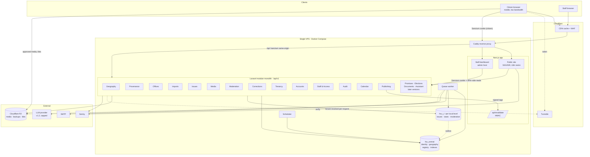

# Hamro Ward — 06 Technical Architecture

> **Status:** Draft v0.2
> **Date:** 2026-09-17
> **Replaces:** the architecture *prompt* previously stored under this filename
> **Decisions:** D-001 (Next.js + Laravel), D-010 (tenant per local level, separate databases), D-011 (citizen accounts, Fortify + Sanctum cookies); proposals D-005 and D-007 (see `DECISIONS.md`)
> **Tenancy and identity detail:** `12_TENANCY_AND_IDENTITY.md`
> **Constraints:** `01` (small part-time team, under €20/month, soft launch soon)

**Principle:** a modular monolith, one server, edge caching, boring technology. Anything that would add a service must show a revisit trigger (§25) before it is introduced.

---

## 1. High-level architecture

```
            Citizens (mobile, low bandwidth)          Staff (moderators, verifiers)
                         │                                      │
                         ▼                                      ▼
     ┌──────────────────────────── Cloudflare (free) ────────────────────────────┐
     │  DNS · TLS · CDN cache (public pages, media, tiles) · WAF · Turnstile      │
     └───────────┬───────────────────────────┬──────────────────────┬────────────┘
      hamroward.<tld>              admin.hamroward.<tld>    api.hamroward.<tld> (partners, later)
     pages cached; /api,/sanctum   all no-store; /api,       no cookie auth
     proxied, no-store             /sanctum proxied
     ┌───────────▼──────────── Single VPS · Docker Compose ─────────▼────────────┐
     │  caddy (reverse proxy, origin TLS)                                        │
     │   ├─ web: Next.js (public site + staff dashboard, host-based routing)     │
     │   └─ api: Laravel on FrankenPHP (REST /api/v1)                            │
     │  worker: Laravel queue worker (database driver)                           │
     │  scheduler: Laravel scheduler                                             │
     │  db: PostgreSQL cluster: hw_central + hw_t_<key> per local level (D-010)  │
     └───────────┬───────────────────────────────────────────────────────────────┘
                 │ S3 API
     ┌───────────▼───────────┐   ┌────────────┐   ┌──────────────────────────┐
     │ Cloudflare R2          │   │ Sentry     │   │ Later: LLM/embeddings    │
     │ media · backups · tiles│   │ errors     │   │ provider (v1.2, capped)  │
     └────────────────────────┘   └────────────┘   └──────────────────────────┘
```

**How requests flow:**

* **Public reads** are rendered by Next.js at build or revalidation time, using server-side calls to the API over the internal Docker network. Cloudflare serves them from cache. **A normal page view does not touch Laravel.**
* **Citizen actions** (sign-in, saved wards, issue reports, uploads; v0.2) go from the browser to `/api/*` on the **same public host**, proxied to Laravel, using Sanctum cookie sessions (host-only cookies), Turnstile and rate limits.
* **Staff traffic** goes to `admin.` (Next.js client UI) and `/api/*` on the **admin host**, with separate staff sessions plus mandatory two-factor auth.
* **Tenancy:** every request touching local data is routed to that local level's database (`12` §6). National data and accounts live in the central database.

---

## 2. Frontend architecture (Next.js)

| Concern | Choice |
|---|---|
| Framework | Next.js App Router, TypeScript strict, React Server Components by default |
| Styling | Tailwind CSS with design tokens from `09` §3, defined as CSS variables |
| i18n | Locale segment `/[locale]` (`ne` default, `en`), a message catalog library (for example `next-intl`), and ICU messages |
| Data fetching | Server-only fetch wrapper → internal `API_INTERNAL_URL` → typed with `packages/api-client` (generated from OpenAPI). Uses `next: { tags, revalidate }` |
| Rendering | Public pages: SSG from the `published-paths` endpoint, plus ISR with a long revalidate window, plus **on-demand revalidation by tag** triggered by Laravel. Staff pages: dynamic client-side rendering, `no-store` |
| Staff dashboard | Same app. Middleware rewrites host `admin.*` to the `/(staff)` route group; public host requests to `/(staff)` return 404 |
| Forms | Progressive enhancement. Client validation mirrors server rules; server errors map to fields |
| Maps (v0.3) | MapLibre GL JS, **dynamically imported** only on map views. The list view is the default on mobile |
| Share images | Route handlers produce OG images. Devanagari shaping is validated by a spike (backlog `HW-E09-F01-T02`); fallback is static images per locale |
| State | Server Components plus URL state. Small client state uses React state only; no global state library |
| Testing | Vitest + Testing Library for components; Playwright smoke tests for critical flows (v0.2+) |

**Folder structure (`apps/web/src`):**

```
app/
  [locale]/(public)/
    page.tsx                                   home
    ward/[province]/[district]/[localLevel]/
      page.tsx                                 local level
      [ward]/page.tsx                          ward profile
    person/[slug]/page.tsx
    issue/[publicId]/page.tsx                  v0.2
    report/page.tsx                            v0.2
    about/ sources/ privacy/ beta/
  (staff)/[locale]/
    login/ queue/ review/[id]/ audit/          v0.2
  api/revalidate/route.ts                      HMAC-verified
  sitemap.ts
  robots.ts
components/
  ui/          primitives
  civic/       SeatRoster, ProvenanceBadge, SourceSheet, StateNotice, WardPlate …
lib/
  api/         fetch wrapper, error mapping
  i18n/
  format/      bs-date, numerals, currency
  seo/
messages/
  ne.json
  en.json
middleware.ts                                  locale + host routing
```

---

## 3. Laravel backend architecture

A modular monolith inside `apps/api`. Modules are namespaces with explicit public entry points.

```
app/
  Modules/
    Tenancy/       Tenant registry, provisioning commands, resolution middleware, reference sync, outbox (12)
    Accounts/      Citizen users, saved wards, My reports, host-based auth config (12 §11–14)
    Geography/     Models, Actions, Queries, Http/{Controllers,Requests,Resources}, Policies, Providers
    Provenance/    Sources, SourceLinks, Conflicts, ProvenanceResolver
    Offices/       Positions, Persons, Parties, OfficeHoldings, Vacancies, SeatStateQuery
    Imports/       Import command, row validators, upserters, reports
    Issues/        (v0.2)
    Media/         (v0.2) upload, ProcessImage job
    Moderation/    (v0.2) state machine, queue queries, decisions
    Corrections/   (v0.2)
    Staff/         (v0.2) auth glue, roles, affiliation, recusals, settings
    Audit/         AuditLogger, listeners
    Calendar/      BsDate service, fiscal years
    Publishing/    revalidation dispatcher, published-paths
    Promises/      (v0.5)
    Elections/     (v0.6)
    Documents/     (v1.2) ingestion, OCR
    Assistant/     (v1.2) retrieval, generation, evaluation
  Support/         shared value objects (LocalizedText, DateValue), problem+json, ids
routes/
  api_v1.php       grouped per module
database/
  migrations/
    central/       central database (05 §12)
    tenant/        applied to every tenant database
  seeders/
tests/
  Arch/            module boundary rules
  Feature/
  Unit/
```

### 3.1 Module rules (enforced by Pest architecture tests)

1. Controllers only validate (Form Requests), call **one** action or query, and return a Resource.
2. Actions are single-purpose classes (`ApproveIssue`, `ImportOfficeHoldings`). They own transactions, dispatch domain events, and write audit events.
3. A module may use another module's **Actions, Queries, Resources, and read-only Models**. It must never write to another module's tables directly.
4. `Audit`, `Provenance`, `Calendar` and `Support` are foundation modules that anyone may use. They must not depend on feature modules.
5. No module names a specific local level, ward number, party or person (R1).

### 3.2 Module dependencies

| Module | Depends on |
|---|---|
| Geography | Provenance, Audit, Calendar |
| Offices | Geography, Provenance, Audit, Calendar |
| Imports | Geography, Offices, Provenance, Audit, Publishing |
| Issues | Geography, Media, Moderation, Audit, Publishing |
| Moderation | Staff, Audit |
| Corrections | Moderation, Audit |
| Promises | Offices, Provenance, Moderation |
| Elections | Geography, Offices, Provenance |
| Assistant | Documents, Provenance, and read-only queries of the others |

### 3.3 Key packages

Chosen for stability; versions pinned in lockfiles.

* `laravel/sanctum` — SPA staff sessions
* `laravel/fortify` — login and TOTP two-factor auth
* `spatie/laravel-permission` — roles and permissions
* `dedoc/scramble` — OpenAPI generated from code
* `intervention/image` — image processing
* Pest, Larastan, Pint — tests, static analysis, formatting

---

## 4. PostgreSQL architecture

| Item | Choice |
|---|---|
| Version and extensions | Current stable PostgreSQL in the `postgis/postgis` image, with `postgis`, `pg_trgm`, `btree_gist`, `citext`. `vector` is added in v1.2 |
| Databases | `hw_central` plus one `hw_t_<tenant_key>` per onboarded local level in the same cluster (D-010, `12` §2) |
| Roles | `hw_owner` owns schemas and runs migrations (deploy and CLI only). `hw_app` has DML without `UPDATE`/`DELETE` on append-only tables. `hw_provisioner` has `CREATEDB` for `hw:tenant:create` only. `hw_backup` is read-only for dumps (`12` §7) |
| Integrity | Foreign keys, `CHECK` constraints, partial unique indexes, exclusion constraints, and triggers for hierarchy level rules (`05`) |
| Search (v0.1–v0.4) | `pg_trgm` GIN indexes on normalized alias columns, plus a `tsvector` with the `simple` config. PostgreSQL has no Nepali stemmer, so matching relies on normalized trigrams |
| Connections | The app connects directly; the pool size is set per container. PgBouncer is added only if connection counts become a problem |
| Tuning | Conservative settings for 4 GB RAM shared with the apps (`shared_buffers` ≈ 512 MB, `work_mem` 8 MB). `pg_stat_statements` enabled |
| Migrations | Expand → migrate → contract (NFR-MNT-04). Each production deploy takes a backup before migrating |

---

## 5. Search architecture

**v0.1–v0.4 — PostgreSQL:**

* The `SearchQuery` action normalizes input: NFC normalization, lower-casing Latin text, stripping Devanagari nukta and chandrabindu variants for matching, and romanization variants (for example `aa` → `a`).
* It queries `admin_unit_aliases`, `person_aliases` and `party_aliases` with trigram similarity plus exact-prefix boost.
* Results are grouped by entity type.

**Revisit trigger** (introduce Meilisearch as a separate service):

* more than 50 published local levels, **or**
* p95 search latency above 300 ms, **or**
* typo tolerance or ranking quality failing the search evaluation set.

The `SearchQuery` interface stays the same, so only its implementation changes.

---

## 6. Redis and queue architecture

| Need | v0–v1 choice | Revisit trigger |
|---|---|---|
| Queue | `database` driver, `jobs` table, one worker container (`--tries=3 --backoff=10,60,300`) | Sustained queue lag above 1 min, or more than 10 jobs/sec |
| Cache | `database` cache store in central; tenant keys prefixed `t:{tenantKey}:` (`12` §9). Public caching happens at the edge | Cache query load visible in `pg_stat_statements` |
| Rate limiting | `database` cache store | Same as above |
| Sessions | Database sessions (staff only) | Same as above |

**Jobs** (all idempotent, keyed by subject ID plus version):

| Job | Trigger | Idempotency |
|---|---|---|
| `ProcessImage` | Upload | Skips if `media.status = ready` |
| `DispatchRevalidation` | Publish, import, approve | Tag sets are safe to repeat |
| `PurgeReporterContacts` | Scheduler, daily | Deletes where the purge date has passed |
| `RotateFingerprintSalt` | Scheduler, every 30 days | Versioned salt |
| `CheckModerationSla` | Scheduler, every 15 min | Alerts deduplicated per item |
| `BackupDatabase` | Host cron (outside Laravel) | Timestamped objects |
| `ExtractDocumentText`, `EmbedChunks` (v1.2) | Document upload | Keyed by content hash |

---

## 7. File storage architecture

| Bucket (R2) | Contents | Access |
|---|---|---|
| `hw-media-private` | Upload originals (deleted after processing), unapproved variants, source documents | Signed URLs for staff only |
| `hw-media-public` | Approved variants | Public through a Cloudflare custom domain `media.` (cached). Object keys are unguessable UUIDs |
| `hw-backups` | Encrypted database dumps | Write-only token for the server; read access through a separate key kept offline |
| `hw-tiles` (v0.3) | PMTiles basemap extract for Nepal | Public, cached |

**Upload flow (v0.2):**

1. Browser downscales the image and uploads it to `POST /api/v1/uploads` with a Turnstile token.
2. The API validates the file by content and stores it in the private bucket, with media status `uploaded`.
3. `ProcessImage` decodes, strips metadata, re-encodes to WebP in `sm` (480 px) and `lg` (1600 px) sizes, deletes the original, and sets status `ready`.
4. When a moderator approves the issue, the variants are copied to the public bucket and visibility is set to `public`.

Laravel's filesystem uses the S3 driver for R2 in production and the `local` disk in development.

---

## 8. Maps architecture (v0.3)

| Layer | Choice |
|---|---|
| Renderer | MapLibre GL JS, lazy-loaded |
| Basemap | Protomaps PMTiles extract covering Nepal, hosted in `hw-tiles` on R2. No per-request tile API costs. OpenStreetMap attribution shown (ODbL) |
| Style | A minimal neutral style with Nepali labels where OSM provides `name:ne` |
| Ward boundaries | Imported into `admin_unit_boundaries` from the source chosen in `07`, with licence recorded. Served as simplified GeoJSON: `GET /api/v1/geo/units/{id}/boundary?simplified=1` (edge-cached) |
| Issue points | `GET /api/v1/wards/{id}/issues.geojson` returns approved issues. Coordinates are rounded according to `location_public_precision` **in the API**, never in the client |
| Clustering | MapLibre client-side clustering (low volume) |
| Low bandwidth | The list view is the default. The map loads only when the user taps "Show map" |
| Validation | `ST_Contains(ward boundary, point)` warns the reporter if the point lies outside the chosen ward |

---

## 9. AI / RAG architecture (v1.2, funding-gated)

```
Question → IntentClassifier (small model or rules)
         ├─ out_of_scope / voting_advice → policy refusal (template, no LLM call)
         └─ factual → Retriever
               ├─ structured queries (offices, candidacies, issues) by intent
               └─ hybrid text retrieval over chunks (tsvector + pgvector), filtered to published
         → EvidencePack (records + sources + authority ranks + conflicts)
         → Generator (LLM, strict system prompt: answer only from the pack, cite ids)
         → CitationValidator (every claim sentence maps to ≥1 evidence id; otherwise drop or refuse)
         → Answer { text, citations[], provenance: ai_generated_summary, confidence }
```

| Concern | Decision |
|---|---|
| Vector storage | pgvector in the existing PostgreSQL (D-005 P7). No separate vector database |
| Embeddings | Multilingual embedding model that handles Nepali and English. Chosen by the evaluation set; model name and dimension recorded in `chunks` |
| Providers | `AssistantProvider` interface with implementations for an external API (default) and Ollama (optional, only when hardware budget exists) |
| Cost | Provider hard cap, plus a daily application-side token budget in `settings`. Past the cap, the assistant shows "temporarily unavailable" |
| Safety | Refusal templates in Nepali and English. Allegations remain labelled as claims. Conflicts are surfaced, never resolved by the model |
| Evaluation | `10_AI_EVALUATION.md`: golden Q&A (Nepali/English), red-team prompts, and CI evaluation run on prompt changes. Metrics: citation rate, unsupported-answer rate, refusal correctness |
| Privacy | `assistant_queries` stores no client identifiers; 180-day retention |

---

## 10. OCR pipeline (v1.2)

```
Upload (staff) → store in private bucket → DetectType
  ├─ PDF with a text layer → extract text (pdftotext)
  │     └─ LegacyFontDetector (Preeti-like glyph patterns) → PreetiToUnicode → normalize NFC
  └─ Scanned PDF or image → rasterize (300 dpi) → Tesseract (nep+eng) → normalize NFC
→ document_pages (text, method, confidence) → staff review (side-by-side) → reviewed
→ chunking → embeddings (only reviewed documents)
```

* Runs in the worker container with the `tesseract-ocr`, Nepali/English language data, and `poppler-utils` system packages.
* Large jobs run one at a time (`queue: documents`, `--max-jobs`) to protect the 4 GB server.

---

## 11. Authentication architecture

Full design in `12` §11. Summary:

| Actor | Mechanism |
|---|---|
| Visitors | No account needed to read. Correction requests allowed signed-out (Turnstile, rate limits) |
| Citizens (v0.2) | `users` in central. Fortify registration, email verification, login, password reset; Sanctum SPA cookie session `hw_session`, host-only on the public host. Verified email required to report |
| Staff (v0.2) | `staff_users` in central, separate from citizens. Fortify login with **mandatory** TOTP; Sanctum cookie session `hw_staff_session`, host-only on the admin host. Global `operator_admin` role + per-tenant memberships |
| Same-origin API | `/api/*` and `/sanctum/*` proxied to Laravel on both hosts; `SESSION_DOMAIN` null; stateful domains = public + admin hosts; CSRF via `XSRF-TOKEN`; no CORS |
| Host-based config | `ConfigureAuthForHost` middleware sets cookie name, Fortify guard and password broker, Sanctum guard per host before the session starts; staff routes 404 on the public host and vice versa |
| Hardening | Login throttles (5/min per email + IP); staff lockout 15 min; staff idle 30 min / absolute 12 h; session regenerated on login; `Secure`, `HttpOnly`, `SameSite=Lax`; enumeration-safe responses |
| Internal | Next.js → API server-side public reads need no auth. Laravel → Next.js revalidation uses an HMAC-SHA256 signature over timestamp + body, ±5 min window |
| Candidates (v0.6) | Magic-link email after operator identity verification; scoped to own candidacy submissions only |

---

## 12. Authorization model

**Roles and permissions**, checked in Laravel **Policies** on every staff endpoint. `operator_admin` is a global spatie role. The other four columns are **tenant membership roles** (`staff_memberships`): they apply only inside the tenant the membership belongs to (`12` §11.5).

| Permission | operator_admin | moderator | verifier | data_editor | viewer |
|---|---|---|---|---|---|
| `issues.moderate` | ✓ | ✓ | | | |
| `corrections.moderate` | ✓ | ✓ | | | |
| `moderation.second_approve` | ✓ | ✓ | ✓ | | |
| `sources.verify` (v0.4) | ✓ | | ✓ | | |
| `data.import` / `data.edit` | ✓ | | | ✓ | |
| `issues.update_lifecycle` | ✓ | ✓ | | | |
| `staff.manage` | ✓ | | | | |
| `affiliations.view` | ✓ | | | | |
| `settings.manage` (kill switch) | ✓ | | | | |
| `audit.view` | ✓ | | | | ✓ |
| `queue.view` | ✓ | ✓ | ✓ | ✓ | ✓ |

**Contextual rules** (policy methods, beyond role checks):

* **Recusal:** deny if any active recusal matches the subject's ward, related persons or parties (FR-MOD-03).
* **Second approval:** the approver must differ from the first actor and must not share the first actor's declared affiliation (D-002).
* **Declaration gate:** no `moderator` or `verifier` role until an affiliation declaration exists (FR-STF-03).

---

## 13. Admin and moderation architecture

* **UI:** Next.js staff dashboard (`admin.` host). Screens are listed in `09` §6.
* **Queue model:** `moderation_items` is a projection of subject states. Actions update the subject and the item in one transaction (`05` §8).
* **State machine** (`Modules/Moderation/StateMachine`):

```
pending ──approve──▶ approved ──archive──▶ archived
   │ ├──reject───▶ rejected (reason required)
   │ └──needs_review──▶ needs_review ──approve/reject──▶ …
approved ──flag (public/staff)──▶ flagged ──approve (restore) / reject / archive──▶ …
restricted: approve ⇒ awaiting second approval ──second_approve──▶ approved
```

* **SLA:** the `CheckModerationSla` job raises alerts when items pass `due_at`. The queue sorts by overdue first, then oldest.
* **Kill switch:** `settings.issues.submissions_paused`. The API returns `503` with a problem+json `type` of `submissions-paused`, and the UI shows a notice.
* **Audit:** every decision emits an `audit_event`. The audit screen can filter by actor, subject, action and date.

---

## 14. Notification architecture

| Version | Channel | Use |
|---|---|---|
| v0.2 | Email (SMTP free tier) | Staff alerts: SLA breaches, second-approval requests, backup failures |
| v0.2 | Telegram bot or email (ops) | Uptime and queue lag alerts to the core team |
| v2.0 | Web push, email digests (opt-in) | Citizens following wards or issues; the notification preference model is designed then |

Laravel Notifications are used with queued delivery. SMS, Viber and WhatsApp are out of scope until funded, because of cost.

---

## 15. Analytics architecture

| Layer | Choice |
|---|---|
| Traffic | Cloudflare Web Analytics: cookieless, no personal data |
| Product events (v0.3) | `POST /api/v1/events` accepts only whitelisted event names (`share_clicked`, `source_opened`, `report_started`, `report_submitted`, `map_opened`). No identifiers; daily counters in `event_counts_daily` (date, event, locale, ward_id NULL) |
| Trust metrics | SQL views: percentage of public facts with verified sources, moderation turnaround percentiles, correction rate, flag resolution time |
| Dashboards | Staff dashboard "Metrics" page (v0.4) |
| Not used | Third-party trackers, session replay, advertising pixels (NFR-PRV-01) |

---

## 16. API architecture

| Aspect | Standard |
|---|---|
| Base | Browser: same-origin `https://hamroward.<tld>/api/v1` (citizens) and `https://admin.hamroward.<tld>/api/v1` (staff). Internal: `http://api/api/v1` |
| Format | JSON. Success: `{ "data": ..., "meta": {...}, "links": {...} }`. Errors: RFC 9457 `application/problem+json` with `type`, `title`, `status`, `detail`, `errors` |
| Localization | Responses include both `*_ne` and `*_en`; the client picks. `Accept-Language` affects only error messages |
| Provenance | Every factual resource includes `provenance: { record: [SourceRef], fields: { party: [SourceRef] }, conflicts: [...] }`, where `SourceRef = { id, title, publisher, source_type, provenance_type, authority_rank, published_at, retrieved_at, url, verification_status }` |
| Pagination | Cursor-based (`?cursor=`) for lists; `limit` ≤ 50 |
| Versioning | URL major version. Breaking changes → `/api/v2`. Additive changes allowed in v1. Stale generated types fail CI |
| Documentation | OpenAPI 3.1 generated by Scramble; `packages/api-client` holds the generated TypeScript types |
| Rate limits | Named limiters: `public-read` 120/min per client; `report` 5/h and 20/day per user, 3/day per user per ward, plus fingerprint backstop; `register` and `forgot` with Turnstile; `staff` 300/min per user; `login` 5/min |
| Tenancy | Local data routes identify the tenant by local level path, ward, or issue `public_id`; staff routes by `/staff/tenants/{tenantKey}` (`12` §6) |
| Caching | Public GET: `Cache-Control: public, s-maxage=300, stale-while-revalidate=86400` plus `ETag`. Authenticated (citizen or staff): `private, no-store` |

**Endpoint catalogue (v0.1–v0.2):**

| Method | Path | Auth | Version |
|---|---|---|---|
| GET | `/health` | none (internal detail hidden publicly) | v0.1 |
| GET | `/geo/units?level=province` | public | v0.1 |
| GET | `/geo/units/{id}` | public | v0.1 |
| GET | `/geo/units/{id}/children` | public | v0.1 |
| GET | `/geo/resolve?path={slugPath}` | public (301-style `redirect_to` in body) | v0.1 |
| GET | `/published-paths` | public | v0.1 |
| GET | `/wards/{id}/profile` | public | v0.1 |
| GET | `/local-levels/{id}/profile` | public | v0.1 |
| GET | `/persons/{slug}` | public | v0.1 |
| GET | `/meta/issue-categories` | public | v0.2 |
| POST | `/register`, `/login`, `/logout`, `/forgot-password`, `/reset-password`, `/email/verification-notification` (Fortify, public host) | public / citizen | v0.2 |
| GET | `/me` | citizen | v0.2 |
| GET, POST, PATCH, DELETE | `/me/wards`, `/me/wards/{id}` | citizen | v0.2 |
| GET | `/me/issues`, `/me/issues/{publicId}` | citizen | v0.2 |
| GET, DELETE | `/me/export`, `/me` | citizen (re-auth for delete) | v0.2 |
| POST | `/uploads?ward={wardId}` | verified citizen | v0.2 |
| POST | `/wards/{wardId}/issues` | verified citizen | v0.2 |
| GET | `/issues/{publicId}` | public (approved only) | v0.2 |
| GET | `/wards/{id}/issues` | public | v0.2 |
| POST | `/corrections` | public + Turnstile | v0.3 |
| POST | `/login`, `/two-factor-challenge`, `/logout` (Fortify, admin host) | staff | v0.2 |
| GET | `/staff/me` (includes memberships) | staff | v0.2 |
| GET | `/staff/tenants/{tenantKey}/moderation/items` | membership `queue.view` | v0.2 |
| GET | `/staff/tenants/{tenantKey}/moderation/items/{id}` | membership `queue.view` | v0.2 |
| POST | `/staff/tenants/{tenantKey}/moderation/items/{id}/decisions` | membership `issues.moderate` / `corrections.moderate` | v0.2 |
| PATCH | `/staff/tenants/{tenantKey}/issues/{id}/lifecycle` | membership `issues.update_lifecycle` | v0.2 |
| GET | `/staff/tenants/{tenantKey}/audit-events`, `/staff/audit-events` (central) | `audit.view` | v0.2 |
| PUT | `/staff/tenants/{tenantKey}/settings/{key}`, `/staff/settings/{key}` (global) | `settings.manage` | v0.2 |
| POST | `/staff/affiliation-declaration` | staff (self) | v0.2 |

---

## 17. Public SEO architecture

* **URLs:** `/{locale}/ward/{province}/{district}/{local-level}/{n}`, `/{locale}/person/{slug}`, `/{locale}/issue/{publicId}`. Lowercase, stable, permanently redirected on change.
* **Metadata:** localized `<title>` and description; `canonical`; `hreflang` for `ne`, `en` and `x-default` (→ `ne`).
* **OpenGraph/Twitter:** localized title, description and 1200×630 image. Images are cached at the edge and versioned by content hash.
* **Structured data (JSON-LD):** `AdministrativeArea` for wards and local levels (with `containedInPlace`); `GovernmentOrganization` for ward offices; `Person` with `hasOccupation`/role for office holders (factual fields only); `BreadcrumbList` everywhere.
* **Sitemaps:** a sitemap index, then one sitemap per published local level, plus static pages. Generated from `/published-paths`.
* **robots:** allow the public host. `admin.` and `api.` hosts send `X-Robots-Tag: noindex` and a disallow-all `robots.txt`.
* **Performance:** SSG plus edge cache, self-hosted subset fonts, no client JavaScript for read-only sections beyond hydration of interactive widgets (NFR-PERF-01/02).

---

## 18. PWA and offline strategy

| Version | Capability |
|---|---|
| v0.1 | Lightweight pages; no service worker (avoids stale-cache bugs during rapid iteration) |
| v1.0 | Web app manifest plus service worker (for example Serwist). Precaches app shell and fonts; stale-while-revalidate for visited ward, person and issue pages (≤ 30 entries, 7-day expiry); offline fallback page |
| v1.0 | Offline issue drafts in IndexedDB. Photos are stored downscaled; submitted with explicit user confirmation when back online (never silently) |
| Rule | Election dates and time-sensitive election pages are **never served from offline cache without a visible "last updated" timestamp** |

---

## 19. Security architecture

### 19.1 Trust boundaries

| # | Boundary | Controls |
|---|---|---|
| TB1 | Internet ↔ Cloudflare | WAF managed rules, DDoS protection, TLS, Turnstile |
| TB2 | Cloudflare ↔ VPS | Firewall allows 80/443 only from Cloudflare IP ranges; origin certificate with Full (strict) TLS; SSH key-only on a non-standard setup with a deploy user |
| TB3 | Browser ↔ API (public writes) | Turnstile verification, rate limits, Form Request validation, content-type checks, size limits, pre-moderation |
| TB4 | Browser ↔ staff dashboard/API | Separate host-only staff session, mandatory TOTP two-factor auth, tenant membership policies, CSRF, strict CSP, `no-store` |
| TB4a | Browser ↔ citizen account API | Host-only citizen session, verified email for reporting, throttles, Turnstile, enumeration-safe responses |
| TB9 | Request ↔ tenant database | Resolution middleware with status/schema guards; membership check before switching; model connection arch tests; isolation suite (`12` §16) |
| TB5 | API ↔ databases | Least-privilege roles per database; provisioner credentials absent from web containers; append-only grants; parameterized queries only |
| TB6 | Worker ↔ R2 | Scoped API tokens per bucket; backups write-only |
| TB7 | API → external providers | Secrets in env files; outbound HTTP only to allow-listed hosts (Turnstile, Sentry, SMTP; LLM in v1.2) |
| TB8 | Laravel → Next.js revalidation | HMAC signature plus timestamp window; internal network only |

### 19.2 Controls checklist (by threat)

| Threat | Controls |
|---|---|
| Spoofing | Staff two-factor auth; no shared accounts; HMAC on internal calls |
| Tampering | Append-only audit tables; database constraints; signed revalidation; content hash on source documents |
| Repudiation | `audit_events` with request IDs; moderation decisions append-only |
| Information disclosure | Encrypted contact fields; public resources never serialize private fields (Resource allow-lists plus tests); EXIF stripping; coordinate rounding server-side; `APP_DEBUG=false` |
| Denial of service | Cloudflare edge cache; rate limits; kill switch; upload size limits; single-concurrency heavy jobs |
| Elevation of privilege | Policies on every staff route (a test asserts every staff route has a policy); role changes audited; declaration gate |
| XSS | React escaping; no `dangerouslySetInnerHTML` except sanitized Markdown (none in v0); CSP with nonces |
| Malicious files | Magic-byte validation; re-encoding; originals deleted; no SVG uploads |
| Supply chain | Lockfiles; `composer audit` and `npm audit` in CI; Dependabot; pinned base images |

### 19.3 Content security policy (public host, v0.1)

```
default-src 'self';
script-src 'self' 'nonce-{n}' https://challenges.cloudflare.com;
style-src 'self' 'unsafe-inline';
img-src 'self' data: https://media.hamroward.<tld>;
connect-src 'self';
frame-src https://challenges.cloudflare.com;
frame-ancestors 'none';
base-uri 'self';
form-action 'self'
```

`style-src 'unsafe-inline'` is tolerated for Next.js style injection. Tightening it is revisited in v1.0.

---

## 20. Deployment architecture

**Hosts:**

| Host | Routes to |
|---|---|
| `hamroward.<tld>` | caddy → web |
| `admin.hamroward.<tld>` | caddy → web (staff routes) |
| `hamroward.<tld>/api/*`, `/sanctum/*` and the same paths on `admin.` | caddy → api (same-origin; bypasses edge cache) |
| `api.hamroward.<tld>` | Reserved for partner APIs (no cookie auth) |
| `media.hamroward.<tld>` | R2 public bucket (custom domain) |

**Compose services (production):**

| Service | Image | Notes |
|---|---|---|
| `caddy` | caddy:2 (pinned) | Origin TLS with the Cloudflare origin certificate; security headers for `api.`/`admin.`; request size limits |
| `web` | `ghcr.io/<org>/hamro-ward-web:<version>` | Next.js standalone output; `NODE_ENV=production`; ~400–600 MB RAM limit |
| `api` | `ghcr.io/<org>/hamro-ward-api:<version>` | FrankenPHP (classic mode); OPcache on; ~512 MB limit |
| `worker` | same api image | `php artisan queue:work --queue=default,media,revalidate --max-time=3600` |
| `scheduler` | same api image | `php artisan schedule:work` |
| `db` | postgis/postgis (pinned) | Named volume; ~1.5 GB memory target |

**Release process** (GitHub Actions, on tag `v*.*.*`):

1. CI green on `main`.
2. Build both images and push them to GHCR with the version tag.
3. SSH to the server as the deploy user and run `deploy.sh <version>`, which:
   * runs `backup.sh` (pre-deploy dumps of central and every tenant to R2),
   * `docker compose pull`,
   * `docker compose run --rm api php artisan migrate --path=database/migrations/central --force` (as `hw_owner`),
   * `docker compose run --rm api php artisan hw:tenant:migrate` (sequential; a failing tenant goes to maintenance, others continue — `12` §8),
   * `docker compose up -d`,
   * a smoke test (`/api/v1/health` plus one public page),
   * and on failure, re-tags the previous version and runs `up -d` again. Down-migrations are never run automatically; migrations are backward-compatible.
4. Post-deploy: `SyncTenantReferenceData` for all tenants, `DispatchRevalidation` for all tags, and a Sentry release marker.

**Environments:**

| Environment | Where | When |
|---|---|---|
| local | Docker Compose on developer machines | v0.1 |
| production | VPS | v0.1 |
| staging | Second Compose project on the same VPS (`staging.` host behind Cloudflare Access or basic auth), smaller limits, anonymized copy of production data | v0.3 |

---

## 21. Backup and recovery architecture

| Item | Policy |
|---|---|
| Database | Nightly `pg_dumpall --globals-only` plus `pg_dump -Fc` of central and **each tenant database**, plus pre-deploy dumps. Any single tenant can be restored alone (`12` §10). Compressed and encrypted with `age` using a public key on the server (the private key is held offline by two people). Uploaded to `hw-backups` |
| Retention | 7 daily, 4 weekly, 3 monthly (lifecycle rules plus a pruning script) |
| Media | Public and private buckets are copied weekly with `rclone` to a backup prefix, and processed variants can be regenerated. Originals are intentionally not retained |
| Configuration | `.env.production` is stored encrypted in the operator's password manager (two admins); infrastructure setup lives in `infra/` in git |
| Restore drill | Monthly and before each minor release. Restore into a scratch Compose project, run integrity checks (row counts, `v_current_seats` sanity, a random audit sample), and record duration in `docs/runbooks/restore.md` |
| Targets | RPO ≤ 24 h, RTO ≤ 4 h (NFR-AVL-02) |
| Disaster | Server loss: provision a new VPS from the runbook, restore the latest dump, point DNS. Expected under 4 h |

---

## 22. Monitoring and observability

| Signal | Tool | Alert |
|---|---|---|
| Errors | Sentry (Laravel and Next.js), release-tagged | New issue or error spike → email |
| Uptime | External uptime checker: public page, `/api/v1/health` | 2 consecutive failures → Telegram/email |
| Health detail | `/api/v1/health?detail=1` (internal network only): db, queue lag, last backup age, disk usage | Queue lag > 10 min; backup older than 26 h; disk > 80% |
| Logs | JSON to stdout, Docker log rotation (10 MB × 5); request ID propagated from Caddy → web → api | — |
| Database | `pg_stat_statements`; weekly slow-query review | — |
| Product and trust | §15 views on the staff Metrics page | Moderation items overdue > 24 h |
| Web vitals | Cloudflare Web Analytics Core Web Vitals | Weekly review against NFR-PERF-01 |

---

## 23. Development environment

* **Requirements:** Docker, Node LTS with pnpm, PHP 8.3+ with Composer (or run PHP inside the container), `make`.
* **`make up`** starts `infra/compose/compose.dev.yml` (postgis and mailpit), runs `apps/api` via `php artisan serve` locally or in a container, and `apps/web` via `pnpm dev`.
* **`make fresh`** runs migrations and seeds positions, source types, categories, BS calendar, and **two fixture tenants** ("Namuna Nagarpalika" with 5 wards and "Udaharan Gaunpalika" with 4 wards, clearly fictional), each in its own database, with fictional persons and test citizen/staff accounts. Real pilot data never lives in the repo.
* **Storage:** `local` disk. **Mail:** mailpit. **Turnstile:** test keys.
* **`make types`** regenerates OpenAPI and `packages/api-client`.
* **Quality:** pre-commit (via lefthook) runs Pint, ESLint and type checks on staged files.

---

## 24. Production environment

| Item | Specification |
|---|---|
| Server | 1 VPS, 2 vCPU / 4 GB RAM / ≥ 40 GB SSD, Ubuntu LTS. Region: EU (cost) initially; revisit Asia region when funded (`01` risk table) |
| OS hardening | Non-root deploy user, SSH keys only, `ufw` (Cloudflare IP allow-list for 80/443), unattended security upgrades, fail2ban for SSH, 2 GB swap, time sync |
| Secrets | `/opt/hamro-ward/.env.production` (mode 600). Separate DB passwords per role. R2 tokens scoped per bucket |
| Edge | Cloudflare: Full (strict), HSTS, "Always use HTTPS", cache rules (cache public HTML by path; bypass `admin.`/`api.`), WAF managed rules, bot fight mode |
| Scaling path | 4 GB → 8 GB vertical resize; then move `db` to a managed or separate server; then add a second `web` replica behind Caddy. No Kubernetes |

---

## 25. What stays in Laravel vs becomes a separate service

| Component | Now | Extract when | Likely form |
|---|---|---|---|
| Search | Postgres inside Laravel (`SearchQuery`) | >50 local levels or quality/latency triggers (§5) | Meilisearch container |
| Queue/cache | Database driver | Lag >1 min or sustained high job volume | Redis container |
| Image processing | Worker job | Upload volume saturates the worker | Separate worker container (same code) |
| OCR/ingestion | Worker job (v1.2) | OCR jobs impact API latency | Dedicated `documents` worker on a separate small server |
| AI assistant | Laravel module calling a provider | Heavy traffic, Python-only tooling needed, or local models funded | Python retrieval/generation service behind an internal API; Laravel keeps policy and citations |
| Realtime | None | Live moderation collaboration or live results | Laravel Reverb container |
| Maps tiles | Static PMTiles on R2 | — | Stays static |
| Public API for third parties | Same `/api/v1` | Partner demand | Same app plus API keys and separate rate limits |

**Anti-goal:** no microservices while the team is fewer than about 6 engineers.

---

## 26. Data flows

**DF1 — Publish official data (v0.1)**

1. The data sheet is exported to CSVs.
2. `hw:import --dry-run` produces a report, which the reviewer checks (D-002).
3. `hw:import` runs in a transaction and emits audit events.
4. `DispatchRevalidation` sends tags to Next.js `/api/revalidate`, which regenerates pages; Cloudflare serves the new versions.

**DF2 — Report an issue (v0.2)**

1. The citizen signs in (or registers and verifies email) and picks a saved ward or any other published ward. The browser downscales the photo.
2. `POST /uploads` returns `media_id`; `ProcessImage` runs asynchronously.
3. `POST /wards/{wardId}/issues` (verified citizen) resolves the ward's tenant, validates, rate-limits, records `reporter_user_id` and relationship, and creates the moderation item and an outbox event. The reporter gets a `public_id` receipt; central `user_issue_index` updates for My reports. Full cross-municipality flow: `12` §13.
4. A moderator reviews it. If it is restricted, a second approval is required.
5. `ApproveIssue` publishes the issue, makes its media public, writes an audit event, and dispatches revalidation of the ward tag.
6. The public issue page is live.

**DF3 — Correction (v0.2)**

1. `POST /corrections` enters the moderation queue.
2. A data editor fixes the record via import (v0.2) or the data UI (v0.4).
3. Audit event, then revalidation, then the correction note (v0.4).

**DF4 — AI answer (v1.2):** see §9.

---

## 27. Repository structure

```
hamro-ward/
├─ apps/
│  ├─ api/                    Laravel (modules in app/Modules)
│  └─ web/                    Next.js (public + staff)
├─ packages/
│  └─ api-client/             generated OpenAPI types + thin fetch helpers
├─ infra/
│  ├─ docker/                 api.Dockerfile, web.Dockerfile
│  ├─ compose/                compose.dev.yml, compose.prod.yml, compose.staging.yml
│  ├─ caddy/                  Caddyfile
│  └─ scripts/                deploy.sh, backup.sh, restore.sh, prune-backups.sh
├─ data/
│  ├─ templates/              import CSV headers (no real data)
│  └─ fixtures/               fictional fixture tenants (Namuna Nagarpalika, Udaharan Gaunpalika)
├─ docs/
│  ├─ 00…12 *.md, DECISIONS.md, CHANGELOG.md, BACKLOG.md
│  └─ runbooks/               deploy.md, restore.md, incident.md, moderation-surge.md
├─ tools/
│  └─ backlog/                build_backlog.py, github_import.py, backlog.json, jira_import.csv
├─ .github/
│  ├─ workflows/              ci-api.yml, ci-web.yml, release.yml
│  ├─ ISSUE_TEMPLATE/
│  └─ PULL_REQUEST_TEMPLATE.md
├─ Makefile
├─ pnpm-workspace.yaml
└─ README.md
```

---

## 28. Architecture diagram


